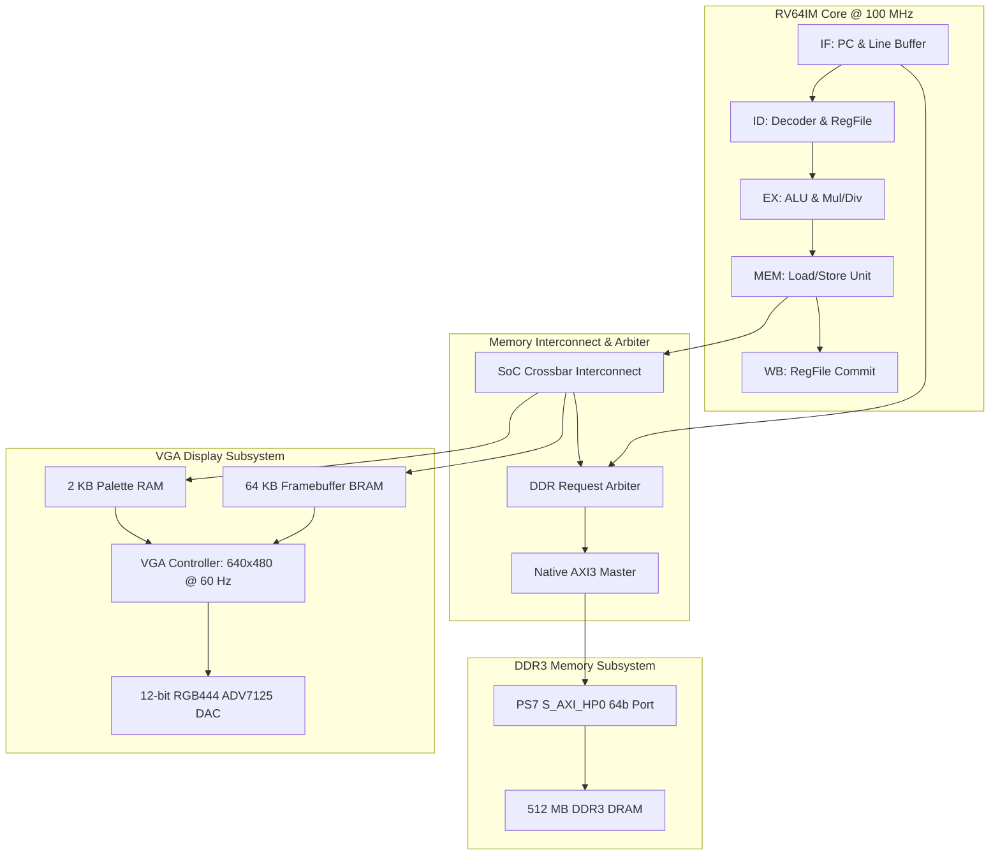

# RV64IM DOOM SoC

> A RISC-V RV64IM CPU and system-on-chip written from scratch in Verilog, running unmodified id Software DOOM bare-metal on a Xilinx ZedBoard.

[](LICENSE)
[](constraints/doom_soc_zedboard.xdc)
[](rtl/)
[](docs/ARCHITECTURE.md)

---

## The System Running DOOM on ZedBoard


*Bare-metal DOOM E1M1 gameplay running in real-time on a 640x480 VGA monitor via the custom RV64IM SoC and dual-port framebuffer on the workbench, featuring authentic 256-color PLAYPAL hardware palette color grading, active weapon firing, and live on-screen FPS readout (3.3 FPS).*

---

## What This Project Is

This repository contains the complete register-transfer level (RTL) Verilog implementation of an in-order 5-stage 64-bit RISC-V (RV64IM) processor and system-on-chip, paired with a bare-metal software port of the 1993 id Software DOOM game engine.

The system synthesizes for the Xilinx Zynq-7000 XC7Z020 FPGA on the Digilent ZedBoard. The processor accesses external 512 MB DDR3 DRAM through the Zynq Processing System's high-performance 64-bit AXI3 interface (`S_AXI_HP0`) and outputs a 2x-scaled 320x200 8-bit indexed color display to standard 640x480 VGA using an on-chip dual-port video framebuffer and runtime-writable palette RAM.

---

## Hardware Highlights

- **Custom RV64IM CPU Core:** In-order 5-stage classic pipeline (`IF`, `ID`, `EX`, `MEM`, `WB`) with full data forwarding, load-use interlocks, 3-cycle pipelined multiplier, and multi-cycle radix-2 divider.
- **Custom Memory Fabric:** Low-overhead SoC crossbar with round-robin I-side and D-side arbitration, prioritizing data transactions to prevent execution stalls.
- **Native AXI3 Master:** High-performance single-outstanding 64-bit AXI3 transaction engine interfacing directly with the Zynq `S_AXI_HP0` port.
- **Dual-Port Framebuffer:** 64 KB on-chip Block RAM holding a 320x200 8bpp frame, accessible simultaneously by the CPU at 100 MHz and the VGA rasterizer at 25 MHz with zero bus contention.
- **Hardware Palette RAM:** 256-entry x 24-bit RGB runtime-writable lookup table at `0x20010000`, enabling authentic in-game damage flashes, item pickup effects, radiation suit tints, and gamma ramps.
- **Bare-Metal Software Stack:** Standalone C runtime (`crt0.S`), freestanding `libc` implementation with formatted printing (`vsnprintf`), in-memory WAD filesystem, and hardware timer drivers.

---

## System Architecture



For complete microarchitecture specifications, pipeline stage contracts, and bus timings, see [docs/ARCHITECTURE.md](docs/ARCHITECTURE.md).

---

## Measured Performance

Performance was captured live over JTAG via the 64-bit microsecond hardware timer (`0x10001018`) and telemetry registers (`0x80530000`) using `scripts/jtag/read_fps.tcl`:

| Metric | Measured Value | Percentage of Frame |
|---|---|---|
| **Sustained Frame Rate** | **2.59 FPS** | — |
| **Total Frame Duration** | **385,971 µs** (385.97 ms) | 100.00% |
| **3D Rendering & Game Logic** | **354,771 µs** (354.77 ms) | **91.92%** |
| **Framebuffer Blit (`I_FinishUpdate`)** | **31,200 µs** (31.20 ms) | **8.08%** |
| **Operating Frequency** | **100.00 MHz** | 10.0 ns cycle period |

### Performance Analysis
The SoC is currently **fetch-bound**. Because the processor lacks an L1 instruction cache, virtually every instruction executed outside the small fetch line buffer incurs a DDR3 round-trip across the AXI bus (~15–20 cycles). The blit routine transfers 64,000 bytes per frame and incurs 48.75 cycles per store instruction, limited by instruction fetch latency rather than BRAM write bandwidth.

Implementing a 4–8 KB direct-mapped L1 instruction cache is estimated to increase performance by **5x–10x**, reaching **13–26 FPS**. See [docs/PERFORMANCE.md](docs/PERFORMANCE.md) for the complete derivation and optimization roadmap.

---

## Repository Structure

```
rv64im-doom-soc/
├── README.md                      # Project overview and shop window
├── LICENSE                        # GNU General Public License v2.0
├── .gitignore                     # Ignores bitstreams, WADs, and Vivado junk
├── .gitattributes                 # Line endings and binary attributes
│
├── docs/                          # Comprehensive technical documentation
│   ├── ARCHITECTURE.md            # Hardware microarchitecture specification
│   ├── ENGINEERING_LOG.md         # Detailed post-mortem of 13 bring-up bugs
│   ├── MEMORY_MAP.md              # Address map and register definitions
│   ├── BRINGUP_GUIDE.md           # Flashing, loading, and gameplay guide
│   ├── PERFORMANCE.md             # Benchmark numbers, derivations, roadmap
│   ├── VERIFICATION.md            # Testbenches and simulation evidence
│   └── images/                    # Hardware photos from workbench bring-up
│
├── rtl/                           # Verilog HDL source code
│   ├── core/                      # 5-stage CPU datapath, hazard unit, ALU, Mul/Div
│   ├── soc/                       # Interconnect, DDR arbiter, native AXI3 master
│   └── peripherals/               # Framebuffer, palette RAM, VGA timing, GPIO, Timer, UART
│
├── constraints/                   # Physical constraints
│   └── doom_soc_zedboard.xdc      # ZedBoard pinout and 100 MHz timing constraints
│
├── sim/                           # Simulation environments & regressions
│   ├── tb/                        # Testbenches (tb_rv64i_core, tb_doom_min, tb_soc_periph)
│   ├── models/                    # Cycle-accurate behavioral DDR3 AXI slave model
│   ├── programs/                  # Test assembly programs (min_test.S, fibonacci)
│   ├── waves/                     # Waveform configurations (.wcfg)
│   └── scripts/                   # Automated simulation scripts (run_min_sim.ps1, run_core_sim.ps1)
│
├── sw/                            # Bare-metal software stack
│   ├── bootloader/                # On-chip BRAM diagnostic bootloader
│   ├── drivers/                   # UART, timer, GPIO, and VGA console drivers
│   ├── common/                    # Freestanding libc (vsnprintf, memory routines)
│   ├── include/                   # Register definitions and driver headers
│   ├── doom/                      # DOOM engine port (doomgeneric) and RV64 platform layer
│   ├── linker/                    # Linker scripts (linker_ddr.ld) and crt0.S
│   └── build/                     # PowerShell build scripts for bootloader and DOOM
│
├── scripts/                       # Automation scripts
│   ├── vivado/                    # One-shot project creation (create_project.tcl, ps7_preset.tcl)
│   └── jtag/                      # XSDB programming, DAP memory loading, and FPS telemetry
│
└── tools/                         # Utilities
    ├── extract_playpal.py         # Extracts 256-color palette from WAD PLAYPAL lump
    ├── generate_diagrams.py       # Renders publication architecture diagrams
    └── get_wad.ps1                # Automated fetch helper for DOOM1.WAD
```

---

## Quick Start Guide

### 1. Obtain the Shareware Asset File
Due to id Software distribution policies, the IWAD file is not committed to git. Run the helper to fetch it:

```powershell
powershell -ExecutionPolicy Bypass -File tools/get_wad.ps1
```

### 2. Compile Software Targets

```powershell
# Compile BRAM Bootloader (produces instructions.mem & data.mem)
powershell -ExecutionPolicy Bypass -File sw/build/build.ps1

# Compile Bare-Metal DOOM for DDR3 (produces sw/build/doom_rv64.bin)
powershell -ExecutionPolicy Bypass -File sw/build/build_doom.ps1
```

### 3. Generate Bitstream or Download Release
Synthesize the complete project headlessly via Vivado:

```powershell
vivado -mode batch -source scripts/vivado/create_project.tcl
```
*Or download pre-built bitstream `doom_soc_top.bit` from GitHub Releases.*

### 4. Program FPGA and Load DRAM via JTAG
Connect your ZedBoard via micro-USB and run:

```powershell
xsdb scripts/jtag/program_and_load.tcl
```

### 5. Launch Gameplay
Upon reset, the bootloader runs diagnostic self-tests on the VGA screen. Press **`BTND`** or flip switch **`SW0`** to jump into DOOM!

For in-depth flashing instructions and troubleshooting, see [docs/BRINGUP_GUIDE.md](docs/BRINGUP_GUIDE.md).

---

## Hardware Controls

| Input Control | Function in Menu | Function in Gameplay (E1M1) |
|---|---|---|
| **`BTNC`** (Center Button) | Select Menu Item / Enter | Fire Weapon / Attack |
| **`BTNU`** (Top Button) | Navigate Up | Move Forward |
| **`BTND`** (Bottom Button) | Navigate Down | Move Backward |
| **`BTNL`** (Left Button) | Back / Cancel | Turn Left |
| **`BTNR`** (Right Button) | Confirm Selection | Turn Right |
| **`SW0`** (Slide Switch 0) | Quick Start / Auto-Launch | — |
| **`SW1`** (Slide Switch 1) | — | Strafe Left |
| **`SW2`** (Slide Switch 2) | — | Strafe Right |
| **`SW3`** (Slide Switch 3) | — | Open Door / Activate Switch (`USE`) |
| **`SW4`** (Slide Switch 4) | — | Run (Fast Speed) |
| **`SW7`** (Slide Switch 7) | **Telemetry Toggle:** DOWN = Milestone Codes, UP = Real-Time `PC[9:2]` |

---

## Verification & Deep Pipeline Bugs

During bring-up, two deep microarchitectural bugs were discovered and resolved using minimal reproduction testbenches and cycle-level simulation:

### Bug 1: Link Register (`ra`) Dropped on Redirect during Fetch Stall
When a `JAL` executed in `EX` while the front-end stalled on DDR fetch latency (`fetch_stall = 1`), the pipeline flush wiped the `EX` stage to a bubble while `fetch_stall` froze `EX/MEM`. The `JAL` was destroyed before its link register writeback (`ra <= PC + 4`) reached `MEM/WB`, causing subroutines to return to address `0x0` in an infinite reboot loop.
- **Fix:** Added `redirect_commit` in `rtl/core/rv64i_core_top.v` to force `EX/MEM` to latch committing redirects regardless of front-end stalls.
- Details in [docs/ENGINEERING_LOG.md#issue-7](docs/ENGINEERING_LOG.md#issue-7--bug-1-link-register-ra-dropped-on-redirect-during-fetch-stall).

### Bug 2: Forwarded Operand Decay During Pipeline Hold
When an instruction in `EX` was held across multiple stall cycles, the producing instruction in `WB` retired and left the pipeline. The forwarding condition de-asserted (`fwd = 00`), causing the operand multiplexer to revert to a stale register file value (`0x00000000`), corrupting heap pointers in `Z_Init`.
- **Fix:** Implemented operand absorption in `rtl/core/ID_EX.v` to capture forwarded values into persistent registers whenever the stage is held.
- Details in [docs/ENGINEERING_LOG.md#issue-8](docs/ENGINEERING_LOG.md#issue-8--bug-2-forwarded-operand-decay-during-pipeline-hold).

Run the automated simulation regressions:
```powershell
powershell -ExecutionPolicy Bypass -File sim/scripts/run_min_sim.ps1
powershell -ExecutionPolicy Bypass -File sim/scripts/run_core_sim.ps1
```
See [docs/VERIFICATION.md](docs/VERIFICATION.md) for full testbench documentation.

---

## Known Limitations & Roadmap

- **No Instruction Cache:** Primary bottleneck limiting performance to 2.59 FPS. Roadmap priority #1.
- **No Hardware Audio:** Sound effects and MIDI music are currently stubbed in software. Future work: I2S audio driver for the ZedBoard ADAU1761 audio codec.
- **Input via Switches/Buttons:** PS/2 keyboard adapter or USB-HID interface planned via second Pmod header.

---

## License & Credits

- **Hardware & SoC:** Licensed under the [GNU General Public License v2.0 (GPL-2.0)](LICENSE).
- **DOOM Game Engine:** Copyright (C) 1993–1996 id Software, Inc. Distributed under GPL-2.0. Port derived from [doomgeneric](https://github.com/ozkl/doomgeneric) and [Chocolate Doom](https://www.chocolate-doom.org/). See [sw/doom/README.md](sw/doom/README.md) for provenance and licensing details.
- **Game Assets:** `DOOM1.WAD` shareware game data is copyright id Software. Users must obtain the shareware WAD independently via `tools/get_wad.ps1`.

---

## Authors & Contributors

Developed and brought up on the ZedBoard by:

- **Ujjawal Khatri** — [GitHub (@UjjawalKhatri)](https://github.com/UjjawalKhatri)
- **Molik Rajvanshi** — [GitHub (@MolikRajvanshi)](https://github.com/MolikRajvanshi)
