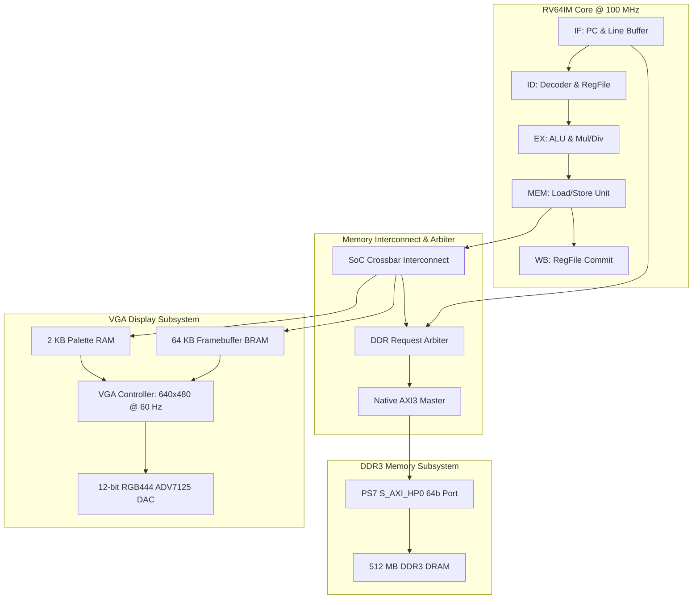

# RV64IM DOOM SoC

> A RISC-V RV64IM CPU and system-on-chip written from scratch in Verilog, running unmodified id Software DOOM bare-metal on a Xilinx ZedBoard.

[](LICENSE)
[](constraints/doom_soc_zedboard.xdc)
[](rtl/)
[](docs/ARCHITECTURE.md)

---

## The System Running DOOM on ZedBoard


*Bare-metal DOOM running on the custom RV64IM SoC, output to a 640x480 VGA monitor with the authentic 256-colour PLAYPAL hardware palette and a live on-screen frame-rate counter. In-game E1M1 combat measures 2.59 FPS over a 32-frame window; the standardised 1,024-frame benchmark averages 3.19 FPS at 100 MHz. See Measured Performance for why both figures are reported.*

---

## What This Project Is

This repository contains the complete register-transfer level (RTL) Verilog implementation of an in-order 5-stage 64-bit RISC-V (RV64IM) processor and system-on-chip, paired with a bare-metal software port of the 1993 id Software DOOM game engine.

The system synthesizes for the Xilinx Zynq-7000 XC7Z020 FPGA on the Digilent ZedBoard. The processor accesses external 512 MB DDR3 DRAM through the Zynq Processing System's high-performance 64-bit AXI3 interface (`S_AXI_HP0`) and outputs a 2x-scaled 320x200 8-bit indexed color display to standard 640x480 VGA using an on-chip dual-port video framebuffer and runtime-writable palette RAM.

---

## Hardware Highlights

- **Custom RV64IM CPU Core:** In-order 5-stage classic pipeline (`IF`, `ID`, `EX`, `MEM`, `WB`) with full data forwarding, load-use interlocks, a multi-cycle multiplier and a multi-cycle radix-2 restoring divider, both interlocked with the pipeline via an execute-stage stall.
- **Custom Memory Fabric:** Low-overhead SoC interconnect with a fixed-priority DDR arbiter that serves data-side requests ahead of instruction fetch, so a pending load or store is never blocked behind a speculative fetch.
- **Native AXI3 Master:** High-performance single-outstanding 64-bit AXI3 transaction engine interfacing directly with the Zynq `S_AXI_HP0` port.
- **Dual-Port Framebuffer:** 64 KB on-chip Block RAM holding a 320x200 8bpp frame. The CPU port and the VGA scan-out port are independent, so display refresh never contends with CPU writes. Both run in the 100 MHz domain; the VGA rasteriser advances on a 25 MHz pixel-enable strobe.
- **Hardware Palette RAM:** 256-entry x 24-bit RGB runtime-writable lookup table at `0x20010000`, enabling authentic in-game damage flashes, item pickup effects, radiation suit tints, and gamma ramps.
- **Bare-Metal Software Stack:** Standalone C runtime (`crt0.S`), freestanding `libc` implementation with formatted printing (`vsnprintf`), in-memory WAD filesystem, and hardware timer drivers.

---

## System Architecture



For complete microarchitecture specifications, pipeline stage contracts, and bus timings, see [docs/ARCHITECTURE.md](docs/ARCHITECTURE.md).

---

## Measured Performance

Performance was captured live over JTAG via the 64-bit microsecond hardware timer (`0x10001018`) and telemetry registers (`0x80530000`) using `scripts/jtag/read_fps.tcl`:

> **Two different figures appear below, and both are correct.** The table in
> this section is a *windowed* reading: the frame rate over the last 32 frames
> during E1M1 corridor combat, which is the heaviest scene in the game. The
> multi-frequency table that follows is a *whole-run average* over 1,024 frames
> of the attract/demo loop, which includes lighter menu and title screens. The
> windowed figure shows what the hardware does under load; the 1,024-frame
> average is the only one suitable for comparing builds, because a 32-frame
> window swings by more than 2x with scene content alone — far more than the
> difference between two clock frequencies.

| Metric | Measured Value | Percentage of Frame |
|---|---|---|
| **Windowed Frame Rate (32 frames, in-game E1M1)** | **2.59 FPS** | — |
| **Total Frame Duration** | **385,971 µs** (385.97 ms) | 100.00% |
| **3D Rendering & Game Logic** | **354,771 µs** (354.77 ms) | **91.92%** |
| **Framebuffer Blit (`I_FinishUpdate`)** | **31,200 µs** (31.20 ms) | **8.08%** |
| **Operating Frequency** | **100.00 MHz** | 10.0 ns cycle period |

### Multi-Frequency Benchmark Comparison (1,024-Frame Standardized Attract Loop)

To isolate pure clock frequency scaling from scene variance, all three hardware builds were benchmarked over **1,024 consecutive frames** using the automated, zero-input attract/demo loop protocol (`scripts/jtag/measure_fps.tcl`):

| Operating Target | Fabric Clock | Timing (WNS) | Failing Endpoints | 1,024-Frame Benchmark | Average Frame Duration | Blit Latency (Fixed Workload) |
|---|---|---|---|---|---|---|
| `doom_soc_top.bit` | 100.00 MHz | −4.015 ns (not met) | 2,990 / 11,751 | **3.19 FPS** | 312,502 µs | 31,169 µs (9.97%) |
| `doom_soc_top_75mhz.bit` | 75.00 MHz | −1.209 ns (not met) | 2,083 / 11,904 | **2.64 FPS** | 378,293 µs | 36,906 µs (9.75%) |
| **`doom_soc_top_50mhz.bit`** | **50.00 MHz** | **+0.972 ns (met)** | **0 / 10,492** | **2.11 FPS** | 473,680 µs | 47,955 µs (10.12%) |

> **Only the 50 MHz build closes timing.** It is the one signed-off configuration:
> WNS +0.972 ns, WHS +0.047 ns, zero failing endpoints across all 10,492. The
> 100 MHz and 75 MHz bitstreams are over-clocked builds that run reliably on the
> boards tested here but carry negative setup slack, so they are not guaranteed
> across parts, voltage or temperature. They are reported because the point of
> the sweep is the frequency-scaling curve, not a timing sign-off.
>
> The WNS figures above are from the implemented runs that produced those three
> bitstreams. A fresh 50 MHz build from `create_project.tcl` reproduces the
> result at **+0.949 ns, 0 failing endpoints of 10,507** — ordinary placer and
> router run-to-run variation, not a different design.

### Resource Utilisation (XC7Z020-CLG484-1)

The entire SoC — CPU, memory fabric, AXI3 master, framebuffer, VGA scan-out and
peripherals — fits in roughly a tenth of the smallest Zynq-7000 part. Figures
below are the 50 MHz signed-off build, straight from `report_utilization`:

| Resource | Used | Available | Utilisation |
|---|---|---|---|
| LUT | 5,794 | 53,200 | **10.89%** |
| LUTRAM | 184 | 17,400 | 1.06% |
| FF | 2,468 | 106,400 | **2.32%** |
| BRAM | 18 | 140 | **12.86%** |
| DSP | 16 | 220 | 7.27% |
| IO | 36 | 200 | 18.00% |
| BUFG | 2 | 32 | 6.25% |
| MMCM | 1 | 4 | 25.00% |

The 18 BRAMs are the 64 KB framebuffer plus the 8 KB boot instruction and data
memories; the 16 DSP48E1s implement the RV64M 64x64 multiplier. The single MMCM
is the 100 MHz to 50 MHz clock generator — at the 100 MHz target `clk_gen`
synthesises to a plain wire and no MMCM is used at all.

Reproduce any of it with:

```powershell
vivado -mode batch -source scripts/vivado/create_project.tcl -tclargs rv64im_doom_soc_proj build 50 impl
```

### Performance Analysis
Because the processor has no L1 instruction cache, nearly every instruction outside the small fetch line buffer incurs a DDR3 round trip across the AXI bus. The framebuffer blit writes 64,000 bytes per frame and measures **48.75 cycles per byte store** (31,200 µs × 100 MHz / 64,000 stores) — far above the 1–2 cycles a Block RAM write costs, which shows the blit is bounded by instruction fetch rather than by framebuffer write bandwidth. Fitting $B(f) = C/f + M$ to the blit durations demonstrates that **46.15% of memory operation time is fixed DDR3 controller round-trip latency**, predicting 75 MHz blit duration to within **0.38%** of silicon measurements.

Implementing a 4–8 KB direct-mapped L1 instruction cache is estimated to increase performance by **5x–10x**, which against the 3.19 FPS whole-run average at 100 MHz projects to roughly **16–32 FPS**. See [docs/PERFORMANCE.md](docs/PERFORMANCE.md) for the complete derivation and optimization roadmap.

---

## Repository Structure

```
rv64im-doom-soc/
├── README.md                      # Project overview and shop window
├── LICENSE                        # GNU General Public License v2.0
├── .gitignore                     # Ignores bitstreams, WADs, and Vivado junk
├── .gitattributes                 # Line endings and binary attributes
│
├── docs/                          # Comprehensive technical documentation
│   ├── ARCHITECTURE.md            # Hardware microarchitecture specification
│   ├── ENGINEERING_LOG.md         # Detailed post-mortem of 13 bring-up bugs
│   ├── MEMORY_MAP.md              # Address map and register definitions
│   ├── BRINGUP_GUIDE.md           # Flashing, loading, and gameplay guide
│   ├── PERFORMANCE.md             # Benchmark numbers, derivations, roadmap
│   ├── VERIFICATION.md            # Testbenches and simulation evidence
│   └── images/                    # Hardware photos from workbench bring-up
│
├── rtl/                           # Verilog HDL source code
│   ├── core/                      # 5-stage CPU datapath, hazard unit, ALU, Mul/Div
│   ├── soc/                       # Interconnect, DDR arbiter, native AXI3 master
│   └── peripherals/               # Framebuffer, palette RAM, VGA timing, GPIO, Timer, UART
│
├── constraints/                   # Physical constraints
│   └── doom_soc_zedboard.xdc      # ZedBoard pinout and 100 MHz timing constraints
│
├── sim/                           # Simulation environments & regressions
│   ├── tb/                        # tb_rv64i_core, tb_doom_min, tb_soc_periph, tb_vga_div
│   ├── models/                    # Cycle-accurate behavioral DDR3 AXI slave model
│   ├── programs/                  # Test assembly programs (min_test.S, fibonacci)
│   └── scripts/                   # run_all.ps1 (entry point) + per-testbench runners
│
├── sw/                            # Bare-metal software stack
│   ├── bootloader/                # On-chip BRAM diagnostic bootloader
│   ├── drivers/                   # UART, timer, GPIO, and VGA console drivers
│   ├── common/                    # Freestanding libc (vsnprintf, memory routines)
│   ├── include/                   # Register definitions and driver headers
│   ├── doom/                      # DOOM engine port (doomgeneric) and RV64 platform layer
│   ├── linker/                    # Linker scripts (linker_ddr.ld) and crt0.S
│   └── build/                     # PowerShell build scripts for bootloader and DOOM
│
├── scripts/                       # Automation scripts
│   ├── vivado/                    # One-shot project creation (create_project.tcl, ps7_preset.tcl)
│   └── jtag/                      # XSDB programming, DAP memory loading, and FPS telemetry
│
└── tools/                         # Utilities
    ├── extract_playpal.py         # Extracts 256-color palette from WAD PLAYPAL lump
    └── get_wad.ps1                # Automated fetch helper for DOOM1.WAD
```

---

## Quick Start Guide

### 1. Obtain the Shareware Asset File
Due to id Software distribution policies, the IWAD file is not committed to git. Run the helper to fetch it:

```powershell
powershell -ExecutionPolicy Bypass -File tools/get_wad.ps1
```

### 2. Compile Software Targets

```powershell
# Compile BRAM Bootloader (produces instructions.mem & data.mem)
powershell -ExecutionPolicy Bypass -File sw/build/build.ps1

# Compile Bare-Metal DOOM for DDR3 (produces sw/build/doom_rv64.bin)
powershell -ExecutionPolicy Bypass -File sw/build/build_doom.ps1
```

### 3. Build the Vivado Project and Bitstream

`scripts/vivado/create_project.tcl` creates the project, generates the Zynq PS7
IP, wires in the constraints and BRAM images, and runs the flow. The last two
arguments select the fabric clock (`100` / `75` / `50`) and how far to go.

```powershell
# Project only, ~1 min. Browse sources, RTL schematic, elaborate.
vivado -mode batch -source scripts/vivado/create_project.tcl -tclargs rv64im_doom_soc_proj build 50 setup

# Project + synthesis + implementation, ~20-40 min.
# Produces the Device view, timing summary and utilization reports.
vivado -mode batch -source scripts/vivado/create_project.tcl -tclargs rv64im_doom_soc_proj build 50 impl

# As above, plus the bitstream.
vivado -mode batch -source scripts/vivado/create_project.tcl -tclargs rv64im_doom_soc_proj build 50 all
```

Everything lands in `build/` (git-ignored): the project, the routed checkpoint,
and `build/reports_<mhz>mhz/` with the timing and utilization reports. The script
prints WNS, WHS and a plain TIMING MET / NOT MET verdict when it finishes.

> Run `sw/build/build.ps1` (step 2) first. It generates `instructions.mem` and
> `data.mem`, the boot BRAM images the RTL `$readmemh`-es at elaboration. The
> project still builds without them — the script warns and the boot ROM comes up
> empty — but the bootloader will not run on hardware.

### 4. Program FPGA and Load DRAM via JTAG
Connect your ZedBoard via micro-USB and run:

```powershell
xsdb scripts/jtag/program_and_load.tcl
```

### 5. Launch Gameplay
On reset the bootloader runs its self-tests on the VGA screen. Press `BTND` to jump to DOOM in DDR3. At the title menu, flip `SW2` UP to select **New Game**, then flip it down and up again to choose a skill level.

For in-depth flashing instructions and troubleshooting, see [docs/BRINGUP_GUIDE.md](docs/BRINGUP_GUIDE.md).

---

## Hardware Controls

| Input | In Menu | In Gameplay |
|---|---|---|
| `BTNU` (top) | Navigate up | Move forward |
| `BTND` (bottom) | Navigate down | Move backward |
| `BTNL` (left) | — | Turn left |
| `BTNR` (right) | — | Turn right |
| `SW2` | **Select (ENTER)** — flip UP to activate | — |
| `SW3` | **Back (ESCAPE)** | Open / close menu |
| `SW0` | — | Fire |
| `SW1` | — | Use / open doors |
| `SW7` | Telemetry view: DOWN = milestone codes, UP = live `PC[9:2]` | |
| `BTNC` | **SYSTEM RESET — do not press during play** | |

> Slide switches are level-held. Flipping a switch UP sends the key press
> (which is what DOOM's menu acts on); flipping it DOWN sends the release.

---

## Verification & Deep Pipeline Bugs

During bring-up, two deep microarchitectural bugs were discovered and resolved using minimal reproduction testbenches and cycle-level simulation:

### Bug 1: Link Register (`ra`) Dropped on Redirect during Fetch Stall
When a `JAL` executed in `EX` while the front-end stalled on DDR fetch latency (`fetch_stall = 1`), the pipeline flush wiped the `EX` stage to a bubble while `fetch_stall` froze `EX/MEM`. The `JAL` was destroyed before its link register writeback (`ra <= PC + 4`) reached `MEM/WB`, causing subroutines to return to address `0x0` in an infinite reboot loop.
- **Fix:** Added `redirect_commit` in `rtl/core/rv64i_core_top.v` to force `EX/MEM` to latch committing redirects regardless of front-end stalls.
- Details in [docs/ENGINEERING_LOG.md#issue-7](docs/ENGINEERING_LOG.md#issue-7--bug-1-link-register-ra-dropped-on-redirect-during-fetch-stall).

### Bug 2: Forwarded Operand Decay During Pipeline Hold
When an instruction in `EX` was held across multiple stall cycles, the producing instruction in `WB` retired and left the pipeline. The forwarding condition de-asserted (`fwd = 00`), causing the operand multiplexer to revert to a stale register file value (`0x00000000`), corrupting heap pointers in `Z_Init`.
- **Fix:** Implemented operand absorption in `rtl/core/ID_EX.v` to capture forwarded values into persistent registers whenever the stage is held.
- Details in [docs/ENGINEERING_LOG.md#issue-8](docs/ENGINEERING_LOG.md#issue-8--bug-2-forwarded-operand-decay-during-pipeline-hold).

Run the full regression suite (one entry point, four testbenches):

```powershell
powershell -ExecutionPolicy Bypass -File sim/scripts/run_all.ps1
```

```
  Core pipeline (tb_rv64i_core)      PASS     169 instructions retired, CPI 1.47
  Minimal SoC (tb_doom_min)          PASS     4 hazard/AXI reproductions
  Peripherals (tb_soc_periph)        PASS     13 / 13 checks
  VGA divider (tb_vga_div)           PASS     PIXEL_DIV = 4 / 3 / 2
  ALL REGRESSIONS PASSED
```

See [docs/VERIFICATION.md](docs/VERIFICATION.md) for full testbench documentation.

---

## Known Limitations & Roadmap

- **No Instruction Cache:** The primary bottleneck. Roughly 46% of memory-operation time is fixed DDR3 round-trip latency that no clock increase can recover, which is why halving the fabric clock costs only ~34% of the frame rate. Roadmap priority #1.
- **No Hardware Audio:** Sound effects and MIDI music are currently stubbed in software. Future work: I2S audio driver for the ZedBoard ADAU1761 audio codec.
- **Input via Switches/Buttons:** PS/2 keyboard adapter or USB-HID interface planned via second Pmod header.
- **Timing closed only at 50 MHz:** the 100 MHz and 75 MHz bitstreams are over-clocked. See the note under Measured Performance.

### Known Hardware Quirks

Found while auditing the design against the documentation. None of them affect
gameplay — the game runs on all three bitstreams — but they are real and are
recorded here rather than left for someone else to trip over.

- **AXI `last_rdata` telemetry at `0x1000_1040` is unreadable.** Two independent
  causes. The interconnect's GPIO decode tests only `addr[5:4] == 2'b00`, so it
  also matches `0x40`–`0x4F` and wins the read mux; and `axi_last_rdata` is
  never declared in `doom_soc_top.v`, so Verilog infers a 1-bit implicit net and
  the 64-bit value is truncated on the way over. The bootloader's `TEST 3`
  consequently prints GPIO state where it claims to print AXI read data. The
  other telemetry registers (`0x1000_1030`, `0x1000_1038`) decode correctly.
- **MMIO writes repeat while the pipeline is stalled.** `data_req_valid` stays
  asserted for as long as the store sits in `MEM`, and `memory_stall` covers
  only the DDR range, so a `fetch_stall` holds the request high for several
  cycles. This is harmless for the framebuffer and the LED register, which are
  idempotent, but a UART FIFO push is not — one store enqueues several bytes.
  Latent in practice: the UART's pins are not brought out in the XDC.
- **Misaligned accesses are silently truncated, not trapped.** The store strobe
  is built as `wstrb << addr[2:0]`, so a multi-byte access straddling an 8-byte
  boundary loses its high bytes. All software here is compiled naturally aligned.
- **Peripherals reset from the raw button pin.** The core uses the synchronised
  `sys_reset`, but `uart_mmio`, `timer_mmio`, `gpio_mmio`, `vga_timing` and
  `framebuffer_mmio` take the unsynchronised top-level `reset` port directly,
  and are not held through MMCM lock in the 75/50 MHz configurations.

---

## License & Credits

- **Hardware & SoC:** Licensed under the [GNU General Public License v2.0 (GPL-2.0)](LICENSE).
- **DOOM Game Engine:** Copyright (C) 1993–1996 id Software, Inc. Distributed under GPL-2.0. Port derived from [doomgeneric](https://github.com/ozkl/doomgeneric) and [Chocolate Doom](https://www.chocolate-doom.org/). See [sw/doom/README.md](sw/doom/README.md) for provenance and licensing details.
- **Game Assets:** `DOOM1.WAD` shareware game data is copyright id Software. Users must obtain the shareware WAD independently via `tools/get_wad.ps1`.

---

## Authors & Contributors

Developed and brought up on the ZedBoard by:

- **Ujjawal Khatri** — [GitHub (@UjjawalKhatri)](https://github.com/UjjawalKhatri)
- **Molik Rajvanshi** — [GitHub (@MolikRajvanshi)](https://github.com/MolikRajvanshi)

See [AUTHORS.md](AUTHORS.md) for individual architectural contributions and division of responsibilities.
