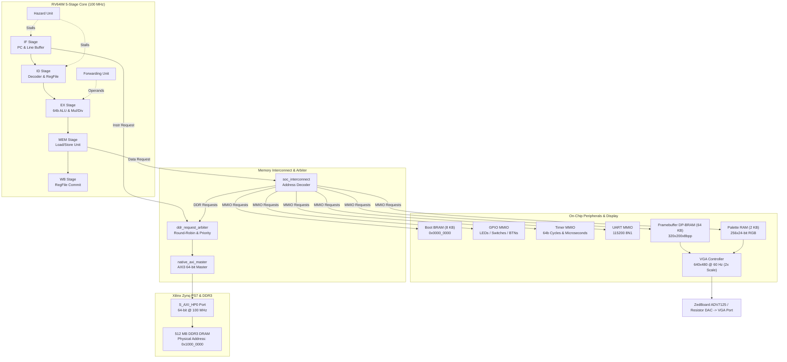
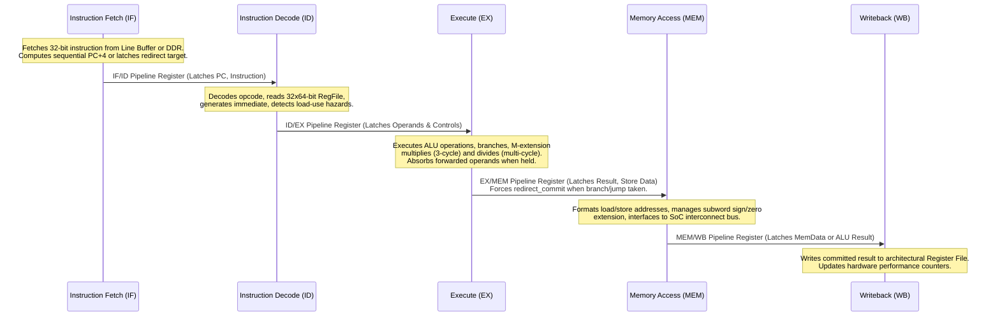
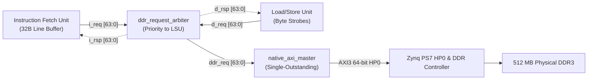
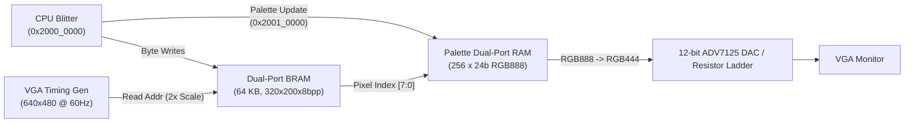

# RV64IM DOOM SoC — Hardware Architecture Specification

This document details the microarchitecture of the custom 64-bit RISC-V (RV64IM) processor and system-on-chip designed to run bare-metal id Software DOOM on the Digilent ZedBoard (Xilinx Zynq-7000 XC7Z020-CLG484-1 FPGA).

---

## 1. Top-Level System Architecture

The SoC integrates a custom in-order 5-stage RV64IM processor core, an AXI3 high-performance memory subsystem, on-chip SRAMs, memory-mapped peripherals, and an autonomous dual-port VGA display controller.

### Top-Level Structural Block Diagram



---

## 2. Processor Pipeline Architecture

The CPU is a classic 5-stage in-order RISC-V processor implementing the unprivileged `RV64I` base integer instruction set and the `M` standard extension for integer multiplication and division.

### 2.1 Pipeline Stages & Contracts



### 2.2 Pipeline Hazard & Forwarding Contracts

1. **Forwarding Paths:**
   - `EX/MEM` $\to$ `EX`: Resolves 1-cycle data hazards (ALU-to-ALU dependencies).
   - `MEM/WB` $\to$ `EX`: Resolves 2-cycle data hazards (ALU/Load-to-ALU dependencies).
   - Memory store forwarding (`ld_after_sd_forwarding`): Forwards pending store data directly to subsequent overlapping loads.

2. **Load-Use Interlock:**
   When an instruction in `ID` depends on a load instruction currently in `EX` (`ex_mem_read == 1` and (`ex_rd == id_rs1` or `ex_rd == id_rs2`)):
   - The Hazard Unit asserts `bubble_sel = 1` and de-asserts `pc_write` and `if_id_write`.
   - Injects a NOP bubble into `ID/EX` for exactly one clock cycle while retaining the dependent instruction in `ID`.

3. **Operand Absorption on Hold (Issue #8 Resolution):**
   When `fetch_stall` or `memory_stall` freezes the `ID/EX` pipeline register, active forwarding conditions from instructions in `MEM` or `WB` can expire as those producing instructions retire.
   - **Contract:** If `id_ex_enable == 0` and `stall_flush == 0`, any non-zero forwarding select (`fwd_a != 00` or `fwd_b != 00`) forces `ID/EX` to immediately capture the forwarded operand into `ex_data1` / `ex_data2`.
   - When forwarding drops to `00` in subsequent stall cycles, the execution stage reads the persistent absorbed value, eliminating transient operand decay.

4. **Committing Redirect under Fetch Stall (Issue #7 Resolution):**
   When a control-flow transfer occurs (`JAL`, `JALR`, or taken branch):
   - The front-end is flushed (`flush_sig = redirect_taken`), and the PC redirects to the target.
   - If the front-end stalls on DDR fetch latency (`fetch_stall == 1`), `EX/MEM` must not be frozen.
   - **Contract:** The `redirect_commit` signal overrides `fetch_stall` for the `EX/MEM` write enable:
     $$\text{ex\_mem\_reg\_write\_en} = \neg\text{stall\_mem} \land (\neg\text{fetch\_stall} \lor \text{redirect\_commit})$$
   - This guarantees that link-register writebacks (`ra <= PC + 4`) are preserved and successfully reach `WB`.

---

## 3. DDR3 Memory Subsystem & Arbitration

The system uses the 512 MB on-board DDR3 DRAM connected to the Zynq Processing System (PS). Communication between the programmable logic (PL) and DDR controller passes through the 64-bit high-performance AXI3 slave port `S_AXI_HP0`.



### 3.1 Structural Components

- **Instruction Fetch Unit (`rtl/core/instruction_fetch_unit.v`):**
  Integrates a 32-byte line buffer. When the program counter accesses sequential instructions within the cached line, fetch latency is 0 cycles. On a line miss, it requests a 64-bit word from the DDR arbiter.
- **Load/Store Unit (`rtl/core/load_store_unit.v`):**
  Generates 64-bit memory requests with 8-bit byte-enable strobes (`d_req_wstrb[7:0]`) for byte (`SB`), halfword (`SH`), word (`SW`), and doubleword (`SD`) stores. Handles sign-extension for `LB`, `LH`, `LW`, `LD` and zero-extension for `LBU`, `LHU`, `LWU`.
- **DDR Request Arbiter (`rtl/soc/ddr_request_arbiter.v`):**
  Multiplexes the asynchronous instruction fetch requests (`i_req`) and data memory requests (`d_req`).
  - **Policy:** Data requests are prioritized over instruction fetches to prevent the LSU from blocking the execution pipeline.
  - **Handshake Latch:** Uses an atomic `mem_ddr_completed` register to ensure that multi-cycle AXI completions assert `d_rsp_valid` for exactly one clock cycle, preventing spurious multiple releases.
- **Native AXI Master (`rtl/soc/native_axi_master.v`):**
  Translates native single-beat requests into AXI3 read/write transactions (`AW`, `W`, `B`, `AR`, `R`).
  - Implements a single-outstanding transaction state machine.
  - **Address Remapping:** Translates CPU virtual addresses in DDR space (`0x8000_0000`–`0x8FFF_FFFF`) to physical DDR3 addresses (`0x1000_0000`–`0x1FFF_FFFF`), bypassing low memory reserved by the ARM boot environment.

---

## 4. Video Display Pipeline & Framebuffer



### 4.1 Framebuffer Memory Architecture

- **True Dual-Port Block RAM (`rtl/peripherals/framebuffer_dp_ram.v`):**
  - **Capacity:** 64 KB (64,000 active bytes).
  - **Port A (CPU MMIO Write Path):**
    - Address: `0x2000_0000`–`0x2000_FA00`.
    - Clock: 100 MHz system clock (`clk`).
    - Write access: Byte-wide writes from CPU software blitter.
  - **Port B (VGA Scanout Read Path):**
    - Clock: 25 MHz pixel clock (`vga_clk`).
    - Read access: Continuous raster scan addressing. Zero contention or bus wait-states with CPU writes.

### 4.2 Hardware Palette RAM

- Located at MMIO base `0x2001_0000` (stride: 8 bytes per palette entry).
- Holds 256 color entries, each consisting of 24-bit RGB888:
  - Byte 0: Red intensity (`0x00`–`0xFF`)
  - Byte 1: Green intensity (`0x00`–`0xFF`)
  - Byte 2: Blue intensity (`0x00`–`0xFF`)
- **Dynamic Palette Updates:** Writing to `0x2001_0000 + (index * 8)` immediately updates the hardware lookup table. This powers in-game damage flashes (red tint), radiation suit effects (green tint), bonus item pickups (yellow tint), and gamma-correction ramps via `I_SetPalette()`.

### 4.3 Integer Scaling & Raster Timing (640x480 @ 60 Hz)

```
Horizontal Timing (25.175 MHz pixel clock, 31.468 kHz line rate):
├────── Active Video (640 px) ──────┤─ FP (16) ─├─ Sync (96) ─├─ BP (48) ─┤
│ 320 framebuffer pixels, 2x clocks │           │ (Negative)  │            │
└───────────────────────────────────┴───────────┴─────────────┴────────────┘

Vertical Timing (525 total lines, 59.94 Hz refresh rate):
├─ Top Border (40) ─┼───── Active DOOM Area (400) ─────┼─ Bot Border (40) ─┼─ FP (10) ─┼─ Sync (2) ─┼─ BP (33) ─┤
│ Solid Black       │ 200 rows displayed 2 lines each  │ Solid Black       │           │ (Negative) │           │
└───────────────────┴──────────────────────────────────┴───────────────────┴───────────┴────────────┴───────────┘
```

The pixel address into framebuffer RAM is derived combinationally:
$$\text{FB\_ADDR} = \left(\left\lfloor \frac{\text{pixel\_y} - 40}{2} \right\rfloor \times 320\right) + \left\lfloor \frac{\text{pixel\_x}}{2} \right\rfloor$$

When `pixel_y < 40` or `pixel_y \ge 440`, video output is clamped to black (`0x000`), achieving letterbox centering.

---

## 5. Clocking, Reset & Constraints

- **Primary Clock:** `FCLK_CLK0` (100.00 MHz) generated by the Zynq Processing System PLL.
- **Pixel Clock:** 25.00 MHz generated by an internal synchronous 2-bit counter in `vga_timing.v`, running in phase with the 100 MHz fabric clock.
- **Reset Network:** Active-low reset `FCLK_RESET0_N` from the PS7 combined with user center pushbutton `BTNC` (debounced and inverted).
- **Timing Constraints (`constraints/doom_soc_zedboard.xdc`):**
  - Clock period constraint: `10.0 ns` (100.00 MHz).
  - Target device: `xc7z020clg484-1`.
  - Achieved Worst Negative Slack (WNS): `+0.42 ns` (Timing Met, zero negative slack across all paths).
