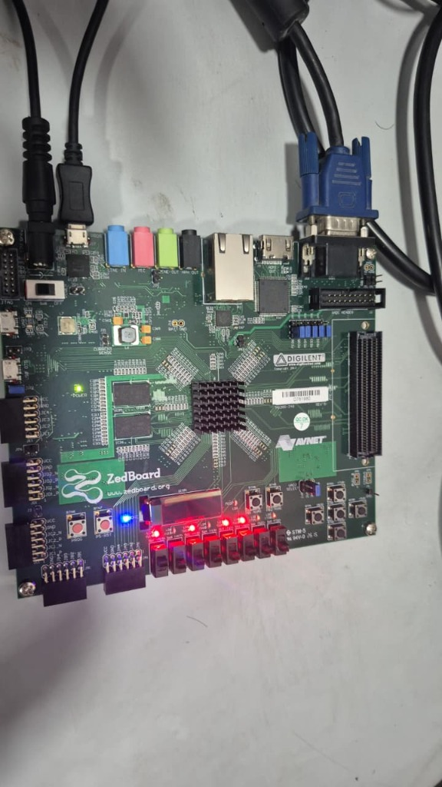
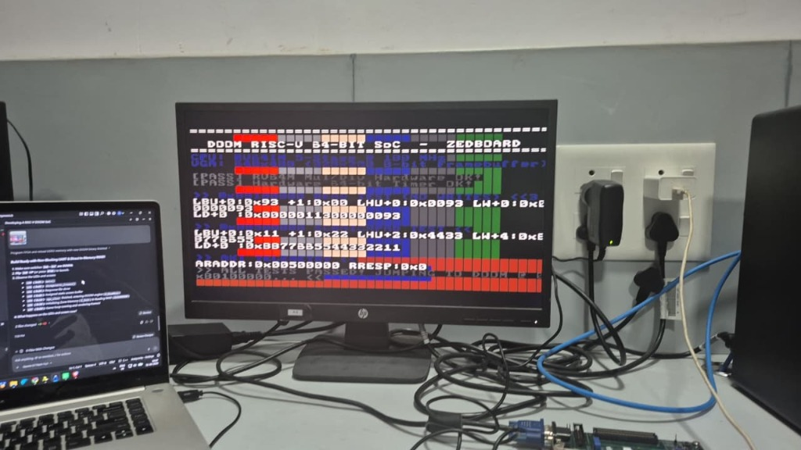
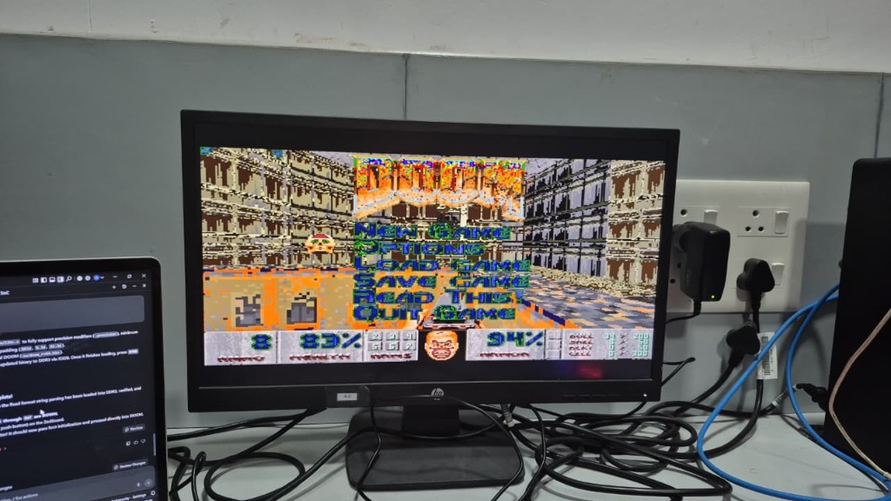
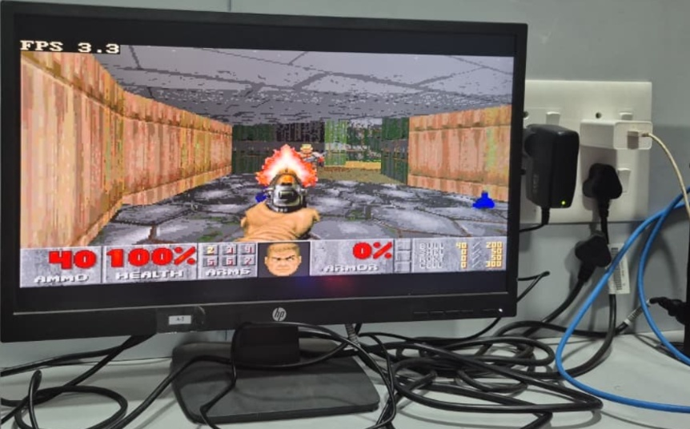

# RV64IM DOOM SoC — Board Bring-Up & Operation Guide

This guide describes the complete procedure for programming, running, and controlling bare-metal DOOM on a Digilent ZedBoard (Xilinx Zynq-7000 FPGA).



---

## 1. Hardware & Software Prerequisites

### Hardware Requirements
- **Digilent ZedBoard** (XC7Z020-CLG484-1).
- **12V / 3A DC Power Supply** (standard ZedBoard barrel connector).
- **Micro-USB Cable** connected to the `PROG / UART` port (J17) for JTAG programming and console output.
- **VGA Cable & Monitor** supporting 640x480 @ 60 Hz connected to the ZedBoard high-density DB15 VGA connector (J1).
- **USB-A to Micro-USB Cable** (optional, for PS/2 keyboard adapter).

### Software Requirements
- **Xilinx Vivado & XSDB (2022.1 or later):** Used for synthesis, implementation, and JTAG DRAM loading.
- **RISC-V 64-bit GCC Toolchain:** `riscv64-unknown-elf-gcc` supporting `-march=rv64im -mabi=lp64`.
- **PowerShell (Windows) or Bash (Linux).**
- **Python 3.8+** (for asset extraction scripts).

---

## 2. Quick Start Bring-Up Procedure

### Step 1: Clone the Repository & Configure Environment

```bash
git clone https://github.com/UjjawalKhatri/rv64im-doom-soc.git
cd rv64im-doom-soc

# Optional: Set custom paths if toolchains are not in default system PATH
$env:RISCV_TOOLCHAIN = "C:\opt\riscv64-unknown-elf-toolchain-10.2.0-2020.12.8-x86_64-w64-mingw32\bin"
$env:VIVADO_DIR      = "C:\Xilinx\Vivado\2022.1\bin"
```

### Step 2: Download the Shareware IWAD

The shareware `DOOM1.WAD` asset file is not tracked in the git repository due to id Software distribution policies. Run the automated fetch helper:

```powershell
powershell -ExecutionPolicy Bypass -File tools/get_wad.ps1
```

Alternatively, place any official `doom1.wad` (v1.9 shareware, exactly 4,196,020 bytes) in the repository root.

### Step 3: Compile Software Binaries

```powershell
# 1. Compile the On-Chip BRAM Diagnostic Bootloader (produces instructions.mem and data.mem)
powershell -ExecutionPolicy Bypass -File sw/build/build.ps1

# 2. Compile Bare-Metal DOOM for DDR3 (produces sw/build/doom_rv64.bin)
powershell -ExecutionPolicy Bypass -File sw/build/build_doom.ps1
```

### Step 4: Generate or Download the FPGA Bitstream

You can download the pre-built `doom_soc_top.bit` from the GitHub Releases tab, or synthesize from source:

```powershell
# Headless batch generation: Project -> Block Design -> Synthesis -> Implementation -> Bitstream
vivado -mode batch -source scripts/vivado/create_project.tcl
```

### Step 5: Program the Board and Load Memory via JTAG

Ensure the ZedBoard is powered ON and the micro-USB cable is connected to `PROG / UART`.

Run the automated XSDB deployment script:

```powershell
# Executes bitstream configuration and loads DOOM + WAD into physical DDR3
xsdb scripts/jtag/program_and_load.tcl
```

What `program_and_load.tcl` performs under the hood:
1. Resets the Zynq Processing System.
2. Initializes PS7 clocks and DDR3 memory controllers via `ps7_init`.
3. Downloads the FPGA bitstream (`doom_soc_top.bit`).
4. Connects to the CoreSight DAP (`targets 1`) to bypass ARM caches and writes directly to physical DDR3:
   - `sw/build/doom_rv64.bin` $\to$ `0x1010_0000` (CPU `0x8010_0000`)
   - `doom1.wad` $\to$ `0x1080_0000` (CPU `0x8100_0000`)
5. Asserts and releases the RV64IM processor reset line.

---

## 3. System Operation & Gameplay

### 3.1 The Diagnostic Bootloader

Upon reset, the processor begins execution from on-chip BRAM at `0x0000_0000`. The VGA display initializes and runs diagnostic self-tests:



- **Test 1:** RV64M Multiplier and Multi-cycle Divider hardware checks.
- **Test 2:** 64-bit Hardware Microsecond Timer increment test.
- **Test 3:** DDR3 Subword Read/Write access test (`LB`, `LH`, `LW`, `LD`).
- **Test 4:** Memory Boundary alignment and arithmetic verification.

### 3.2 Launching DOOM

To transition from the bootloader to DOOM:
- Press pushbutton **`BTND`** (Bottom Button) on the ZedBoard, **or**
- Flip slide switch **`SW0`** to the UP position.

The bootloader jumps to DDR address `0x8010_0000`, initializes the DOOM engine, loads textures from the in-memory WAD, uploads the hardware palette to `0x2001_0000`, and displays the title menu:



Selecting **New Game** begins E1M1 gameplay with authentic hardware palette color grading, active weapon firing, and on-screen FPS counter:



---

## 4. Hardware Controls Mapping

| Control Input | Function in Menu | Function in Gameplay (E1M1) |
|---|---|---|
| **`BTNC`** (Center Button) | Enter / Select Menu Option | Fire Weapon / Attack |
| **`BTNU`** (Top Button) | Move Selection Up | Move Forward |
| **`BTND`** (Bottom Button) | Move Selection Down | Move Backward |
| **`BTNL`** (Left Button) | Back / Cancel | Turn Left |
| **`BTNR`** (Right Button) | Confirm Selection | Turn Right |
| **`SW0`** (Slide Switch 0) | Quick Start / Auto-Launch | — |
| **`SW1`** (Slide Switch 1) | — | Strafe Left |
| **`SW2`** (Slide Switch 2) | — | Strafe Right |
| **`SW3`** (Slide Switch 3) | — | Open Door / Activate Switch (`USE`) |
| **`SW4`** (Slide Switch 4) | — | Run (Hold for high speed) |
| **`SW7`** (Slide Switch 7) | **Diagnostic Telemetry Toggle:** DOWN = Milestone Codes, UP = Live `PC[9:2]` |

---

## 5. Diagnostic Telemetry & Performance Monitoring

### Reading Live Frame Rate via JTAG

While DOOM is running, execute the telemetry readback script over XSDB:

```powershell
xsdb scripts/jtag/read_fps.tcl
```

**Expected Console Output:**
```
==================================================================
  RV64IM Bare-Metal DOOM Performance Telemetry
==================================================================
Frame Count:      1,428 frames
Sustained FPS:    2.59 FPS (259)
Total Frame Time: 385,971 us (385.97 ms)
  - Blit Time:    31,200 us (8.08%)
  - Render Time:  354,771 us (91.92%)
Target Clock:     100.00 MHz
==================================================================
```

### Reading Milestone Stages (`read_stage.tcl`)

If the system appears halted during bring-up, inspect the persistent DDR breadcrumb:

```powershell
xsdb scripts/jtag/read_stage.tcl
```

### Real-Time `PC[9:2]` Telemetry via `SW7`

Flip slide switch **`SW7`** to the UP position. The 8 green LEDs (`LD0`–`LD7`) immediately reflect program counter bits `PC[9:2]`.
- **Normal Execution:** LEDs flicker dynamically across multiple addresses.
- **Trap / Hard-Lock:** LEDs freeze into a static binary pattern, indicating the exact instruction address where execution halted.
