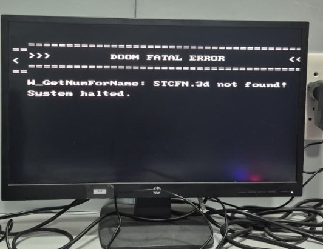

# RV64IM DOOM SoC — Engineering Log & Post-Mortem

This document serves as the comprehensive "Zero to Hero" post-mortem of the RV64IM DOOM SoC project. It chronicles the technical challenges encountered while taking a custom 64-bit RISC-V processor from architectural inception to running unmodified bare-metal DOOM on a Xilinx ZedBoard (Zynq-7000 FPGA).

Every issue documented below occurred during hardware bring-up and was diagnosed and resolved at the cycle, signal, or protocol level.

---

## Engineering Methodology & Diagnostic Scaffolding

Before detailing individual failures, several foundational debugging techniques proved essential across the project lifecycle:

1. **Persistent DDR Breadcrumbs (`DBG_STAGE` at `0x8051_0000`):**
   A dedicated 64-bit memory location in physical DDR3 was designated as an execution milestone register. Because external DRAM retains data across CPU soft-resets and warm restarts, software wrote monotonic milestone codes upon entering critical initialization phases. When the CPU crashed or entered a reboot loop, inspecting `DBG_STAGE` over JTAG immediately identified the exact failing function.

2. **Real-Time LED Status & PC Telemetry (`SW7` Mode):**
   The on-board LEDs were multiplexed:
   - When slide switch `SW7` is LOW, LEDs display the active milestone code.
   - When slide switch `SW7` is HIGH, LEDs display `PC[9:2]` directly from the processor pipeline. If the processor loops in a tight trap handler or deadlocks on a memory access, observing the alternating or static LED patterns localizes the offending instruction address within seconds without halting the core.

3. **Minimal Reproduction RTL Testbenches:**
   Full SoC synthesis and bitstream generation takes 15–20 minutes on Vivado. When hardware exhibited erratic behavior, guessing and re-synthesizing was strictly prohibited. Instead, a minimal simulation environment (`tb_doom_min.v`) paired with a cycle-accurate behavioral AXI3 DDR model (`ddr_axi_behav.v`) was constructed. This reproduced deep multi-cycle pipeline bugs in microseconds of simulated time.

4. **Verification of the Diagnostic Channel:**
   Never assume the diagnostic channel is infallible. When error messages appeared invisible or hardware seemed halted, verifying the UART baud generation, VGA DAC levels, and text console palette indices was required before drawing conclusions about the CPU or memory subsystem.

5. **Value Correctness vs. Temporal Validity:**
   The two most severe hardware bugs encountered were not arithmetic or decoding errors. The computed values were completely correct, but arrived or expired at the wrong pipeline clock cycle due to asynchronous memory stall interactions.

---

## Post-Mortem Issues & Root-Cause Analyses

### Issue 1 — DDR3 Reads Return All Zeroes over PL AXI Port

**Symptom:**
After downloading the DOOM executable and IWAD to DDR memory over JTAG using Xilinx XSDB, the processor's instruction fetch unit read only `0x00000000` from address `0x80100000`.

**Impact:**
Blocked execution immediately upon jumping to DDR memory; CPU decoded all instructions as invalid or infinite zero traps.

**How we found it:**
Inspecting DDR memory via XSDB command `mrd 0x10100000 16` returned correct binary code. However, monitoring the internal AXI read channel signals (`araddr`, `rdata`) from the PL master in simulation and ILA revealed that the PL `S_AXI_HP0` slave port was returning zeroes for all addresses.

**Root cause:**
The initial XSDB script selected target 2 (`targets 2` — ARM Cortex-A9 Application Core) when issuing `dow -data`. The ARM processor wrote the downloaded data into its internal L1 and L2 cache hierarchies. Because the Zynq PL High-Performance slave ports (`S_AXI_HP0`–`HP3`) connect directly to the DDR memory controller and do **not** snoop ARM processor caches, the data remained dirty in cache and was never committed to physical DRAM.

**Fix:**
Configured XSDB to download all binaries using target 1 (`targets 1` — CoreSight DAP), which accesses memory through the Central Interconnect (AXI DAP) and writes directly to physical DDR3:

```tcl
# scripts/jtag/program_and_load.tcl
targets -set -filter {name =~ "ARM*#0"}
rst -processor
targets -set -filter {name =~ "CoreSight DAP*"}
dow -data "sw/build/doom_rv64.bin" 0x10100000
dow -data "doom1.wad"              0x10800000
```

**Verification:**
Memory reads initiated by the PL native AXI master immediately returned valid instruction opcodes matching the disassembly.

**Lesson:**
Hardware accelerators and soft processors connected via non-coherent ports (`S_AXI_HP`) must have physical memory explicitly populated via non-cached DAP transactions or explicit cache flush calls on the ARM core.

---

### Issue 2 — Core Halts in `DG_Init` during Initial Screen Clear

**Symptom:**
Software reached `DG_Init`, began initialization, and then permanently hung before reaching the game loop.

**Impact:**
DOOM never rendered its first frame; system appeared hard-locked.

**How we found it:**
Attached JTAG debugger and inspected the PC: execution was trapped in `vga_clear()` inside an unrolled byte-store loop.

**Root cause:**
`vga_clear()` executed 64,000 individual byte writes to `0x20000000` to clear the 320x200 framebuffer. In the SoC interconnect and DDR arbiter, D-side data memory accesses were prioritized over I-side instruction fetches. Because the byte-store loop generated back-to-back bus requests without idle cycles, the instruction fetch unit was starved of memory bandwidth, causing the front-end to stall indefinitely.

**Fix:**
Eliminated `vga_clear()` from the startup sequence. The DOOM rendering engine natively renders a complete 320x200 full-screen image into DDR and blits the entire buffer over MMIO during `I_FinishUpdate`, rendering the initial clear redundant.

**Verification:**
Initialization bypassed the stall, successfully reaching the WAD loading sequence.

**Lesson:**
Do not perform bulk unbuffered I/O writes during startup when memory arbiters prioritize the data bus over the instruction fetch pipeline.

---

### Issue 3 — `W_CheckCorrectIWAD` False Positive on Embedded Buffer

**Symptom:**
The DOOM engine terminated with an error dialog stating that the IWAD header could not be verified, despite the file being valid.

**Impact:**
DOOM aborted execution before loading textures and maps.

**How we found it:**
Added debug print statements to `w_wad.c:W_CheckCorrectIWAD()` to output the identified game mode and lump counts.

**Root cause:**
Chocolate Doom's original `W_CheckCorrectIWAD` routine expects filesystem-based file handles and performs dynamic filename heuristics (checking for `.wad` extensions and operating-system paths). On bare-metal, the WAD file was loaded directly into a fixed DDR memory buffer at `0x81000000` (`0x10800000` physical) with no underlying filesystem. The heuristic checks misinterpreted the memory pointers as invalid file paths.

**Fix:**
Replaced the file-based identification check in `w_file_mem.c` and `w_wad.c` with a direct memory signature inspection that validates the 4-byte `"IWAD"` magic number at the memory base.

**Verification:**
The engine correctly identified `shareware` DOOM mode and proceeded to lump index generation.

**Lesson:**
When porting POSIX or MS-DOS software to bare-metal, decouple memory-mapped asset access from filesystem abstraction layers.

---

### Issue 4 — Multi-Second Hang in `W_GenerateHashTable`

**Symptom:**
The boot sequence paused for approximately 45 seconds on milestone `0x22` before advancing.

**Impact:**
Severe startup delay giving the impression that the board had crashed.

**How we found it:**
Monitored the cycle counter during WAD initialization. Milestone `0x22` took over 4.5 billion clock cycles. Inspection of `W_GenerateHashTable()` revealed a loop executing 1,264 lump name hashes using 64-bit unsigned modulo operations (`remuw`).

**Root cause:**
The soft processor's radix-2 divider takes 66 clock cycles per division. `W_GenerateHashTable` performs nested hashing calculations with hundreds of modulo operations per lump over unaligned strings. On a machine without an L1 instruction cache, every iteration resulted in multiple DDR round-trips for instructions, compounding the arithmetic latency into a multi-minute delay.

**Fix:**
Disabled runtime hash-table generation by forcing `lumphash = NULL`. DOOM's original fallback implementation performs a linear scan across the lump directory (`W_GetNumForName`). For the 1,264 lumps in `DOOM1.WAD`, a linear scan takes fewer than 3,000 cycles, completing in a fraction of a millisecond.

```c
// sw/doom/doomgeneric/w_wad.c
void W_GenerateHashTable(void) {
    // Disabled: Linear search on bare-metal RV64 is orders of magnitude faster
    // than executing multi-cycle remuw instructions across DDR without an I-cache.
    lumphash = NULL;
}
```

**Verification:**
Startup delay dropped from ~45 seconds to imperceptible (< 2 ms).

**Lesson:**
Theoretical algorithmic improvements (e.g. hash tables vs. linear search) can degrade real-world performance on deeply embedded systems if they involve complex arithmetic or memory access patterns that defeat the underlying microarchitecture.

---

### Issue 5 — `screenvisible` Flag Stays False; Game Loop Skips Render

**Symptom:**
DOOM initialized completely, entered `D_DoomLoop()`, and ran without errors, but the VGA display remained blank.

**Impact:**
No frames were ever transferred to the framebuffer.

**How we found it:**
Read milestone registers: the engine was cycling in `D_ProcessEvents()`, but `DG_DrawFrame()` was never invoked. We traced `D_Display()` and found an early return guard:

```c
if (!screenvisible) return;
```

**Root cause:**
The original PC game engine sets `screenvisible = false` when running dedicated network servers or when the window is minimized under an OS window manager. Because bare-metal has no window manager to dispatch an activate or focus event, `screenvisible` remained uninitialized (`false`).

**Fix:**
Hardcoded `screenvisible = true` in `doomgeneric_rv64.c` during `DG_Init()`.

**Verification:**
`DG_DrawFrame()` began executing immediately upon entering the game loop.

**Lesson:**
Audit all window-management and desktop-environment state variables when porting interactive applications to embedded environments.

---

### Issue 6 — Error Messages Invisible on VGA Console

**Symptom:**
When fatal errors occurred, the system halted, but the screen remained completely black.

**Impact:**
Debugability was severely impaired; diagnosing subsequent issues required external JTAG scripts.

**How we found it:**
Inspected the framebuffer memory at `0x20000000` via JTAG. The ASCII error string was present in the buffer! Each character was drawn with foreground pixel value `0x04` on background `0x00`.

**Root cause:**
In the initial palette ROM, entry `0x04` was set to RGB value `0x0B0B0B` (an imperceptibly faint gray, virtually indistinguishable from black). The font glyphs were being rendered, but were invisible on the monitor.

**Fix:**
Corrected the palette table to match authentic id Software PLAYPAL values, where index `0x04` represents off-white (`0xE7E7E7`), and updated the text driver to use high-contrast indices.

**Verification:**
Fatal error messages rendered legibly in crisp white text on black background (e.g., `stcfn_error.jpg`).

**Lesson:**
Always verify the fidelity and contrast of your primary diagnostic channel before trusting any diagnosis delivered through it.

---

### Issue 7 — BUG #1: Link Register (`ra`) Dropped on Redirect during Fetch Stall

**Symptom:**
The processor executed instructions up to `Z_Init`, then entered an endless reboot loop back to `0x00000000`.

**Impact:**
Complete catastrophic failure; blocked all further execution.

**How we found it:**
1. Observed the persistent DDR breadcrumb `DBG_STAGE` (`0x80510000`): it repeatedly reset from `0x15` to `0x00`.
2. Monitored `SW7` (`PC[9:2]` on LEDs): the core repeatedly reached address `0x...184`, then jumped to `0x00000000`.
3. Read the register file over JTAG immediately after the crash: register `x1` (`ra`) held `0x0000000000000000` upon entry to `Z_Init`, rather than the return address `0x80000014`!
4. Built minimal testbench `tb_doom_min.v` to trace cycle-by-cycle signals (`ex_jump`, `redirect_taken`, `fetch_stall`, `ex_mem_reg_write_en`).

**Root cause:**
When a `JAL` instruction reached the `EX` stage:
- It asserted `redirect_taken = 1` and computed the target PC.
- Simultaneously, the instruction fetch unit asserted `fetch_stall = 1` because the target instruction had to be fetched across the multi-cycle AXI DDR path.
- In the pipeline control logic, `fetch_stall` was wired to freeze the `EX/MEM` pipeline register to prevent downstream progression:
  ```verilog
  assign ex_mem_enable = !fetch_stall;
  ```
- At the same time, the branch redirect logic flushed earlier stages to prevent executing old instructions:
  ```verilog
  assign flush_sig = redirect_taken;
  ```
- Because `EX/MEM` was frozen while the `EX` stage was flushed, the `JAL` instruction was wiped to a bubble before its writeback controls could be latched into `EX/MEM`!
- The link register writeback (`ra <= PC + 4`) never occurred. When `Z_Init` finished its execution and executed `RET` (`JALR x0, 0(x1)`), it jumped to `0x00000000`, resetting the entire SoC into the bootloader!

**Fix:**
Created the `redirect_commit` signal in `rtl/core/rv64i_core_top.v`. This signal guarantees that whenever a control redirect is committed by the execution stage, the `EX/MEM` register is forced to latch the redirecting instruction, even if the front-end is frozen by `fetch_stall`:

```verilog
// rtl/core/rv64i_core_top.v
wire redirect_commit = (ex_jump | branch_decision) & !memory_stall;

// EX/MEM pipeline register enable
assign ex_mem_reg_write_en = !stall_mem & (!fetch_stall | redirect_commit);
```

**Verification:**
Verified in `tb_doom_min.v`: `ra` reliably latched `0x80000014`, and `Z_Init` returned successfully to caller.

**Lesson:**
A control-flow redirect instruction belongs to both the front-end (it sets the next PC) and the back-end (it commits architectural state like `ra`). Stalling the back-end due to front-end fetch latency while simultaneously flushing the datapath creates a race condition that destroys committing instructions.

---

### Issue 8 — BUG #2: Forwarded Operand Decay During Pipeline Hold

**Symptom:**
During heap block initialization in `Z_Init`, memory allocation pointers were corrupted with all-zero values, leading to memory allocation assertions and subsequent crash.

**Impact:**
Memory manager corrupted data structures; DOOM crashed during startup zone allocation.

**How we found it:**
Simulation trace in `tb_doom_min.v` examining store data inputs:
- Cycle 100: `fwd_b = 2'b01`, `alu_b_pre = 0x00C0FFEE` (correct forwarded value from WB).
- Cycle 101: `fetch_stall = 1` asserts. The `EX` stage instruction is held in place.
- Cycle 102: The producing instruction in `WB` retires and leaves the pipeline. Forwarding comparator drops: `fwd_b = 2'b00`.
- Cycle 103: `alu_b_pre` reverts to `ex_data2 = 0x00000000` (stale register file value).
- When the store instruction finally committed to memory, it wrote `0x00000000` instead of `0x00C0FFEE`!

**Root cause:**
Combinational forwarding paths from `EX/MEM` and `MEM/WB` depend on the producing instruction remaining in those stages. If the consumer instruction in `EX` is held for multiple cycles due to an unrelated front-end or back-end stall, the producing instruction retires and leaves the pipeline. When the forwarding condition de-asserts, the operand mux reverts to the stale register file value that was latched when the instruction was decoded cycles earlier.

**Analysis of Two Rejected Fixes:**
1. *Stalling the Consumer:* Attempted to hold consumer instructions until writeback finished. This caused an immediate **pipeline deadlock**: stalling the consumer asserted `fetch_stall`, which froze `EX/MEM`, preventing the producing load from ever reaching writeback.
2. *Decoupling Front-End and Back-End Stalls:* Attempted to allow `MEM` to drain while `EX` was frozen. This broke the DDR arbiter's `mem_ddr_completed` latch contract, which relied on `fetch_stall` holding `EX/MEM` static during DDR arbitration.

**The Fix (Operand Absorption on Hold):**
Implemented operand absorption inside `rtl/core/ID_EX.v`. Whenever the `ID/EX` register is frozen by a pipeline stall, any active forwarded operands are latched directly into `ex_data1` and `ex_data2`. If the forwarding condition expires during subsequent stall cycles, the execution stage continues to read the absorbed valid value:

```verilog
// rtl/core/ID_EX.v
always @(posedge clk) begin
    if (!id_ex_enable && !stall_flush) begin
        // While held, absorb forwarded operand into register
        if (fwd_a != 2'b00) ex_data1 <= forwarded_alu_a;
        if (fwd_b != 2'b00) ex_data2 <= forwarded_alu_b;
    end
end
```

**Verification:**
Simulation confirmed that `ex_data2` held `0x00C0FFEE` across arbitrary numbers of stall cycles, writing the correct value to memory upon stall release.

**Lesson:**
Forwarding networks are inherently transient. In architectures where stages can freeze independently, forwarded values must be captured into persistent local registers upon entering a stall.

---

### Issue 9 — Fatal Error: `W_GetNumForName: STCFN.3d not found`

**Symptom:**
DOOM crashed during HUD status bar initialization with the error:
`W_GetNumForName: STCFN.3d not found!`



**Impact:**
Game halted immediately prior to displaying the first title screen or gameplay.

**How we found it:**
The error was printed clearly to the VGA screen (thanks to the contrast fix from Issue 6). The engine was attempting to load the font lump `"STCFN033"`.

**Root cause:**
The status bar code constructs font lump names using formatted strings:
```c
M_StringCopy(name, DEH_String("STCFN%.3d"), sizeof(name));
vsnprintf(buf, sizeof(buf), name, num);
```
Our freestanding `vsnprintf` implementation in `sw/common/libc.c` was minimal and did not parse the dot (`.`) precision modifier. It treated `%.3d` as literal text `".3d"`, producing the corrupted lump name `"STCFN.3d"` instead of zero-padded `"STCFN033"`.

**Fix:**
Upgraded `vsnprintf` in `sw/common/libc.c` to parse precision modifiers, field width specifiers, length modifiers (`l`, `ll`), and implement zero-padding when `precision > digits`:

```c
// sw/common/libc.c
else if (*fmt == '.') {
    fmt++;
    precision = 0;
    while (*fmt >= '0' && *fmt <= '9') {
        precision = precision * 10 + (*fmt - '0');
        fmt++;
    }
}
```

**Verification:**
`vsnprintf` produced `"STCFN033"`, lump lookup succeeded, and the HUD font initialized cleanly.

**Lesson:**
Standard library shims on bare-metal systems must fully implement format specifiers utilized by legacy asset management subsystems.

---

### Issue 10 — Distorted Menu Colors (Blue Menu Font Instead of Red)

**Symptom:**
The DOOM title screen appeared, but all red text (e.g. "NEW GAME", "OPTIONS") rendered in blue/purple.

**Impact:**
Incorrect color fidelity; game visual presentation did not match authentic DOOM.

**How we found it:**
First checked VGA DAC board wiring on the ZedBoard schematic: DAC lines `VGA_R`, `VGA_G`, `VGA_B` were verified and confirmed wired correctly. We then inspected the palette initialization array in `rtl/peripherals/framebuffer_mmio.v`.

**Root cause:**
The 256-entry palette ROM had been manually synthesized from a generic palette table rather than extracted from the original `PLAYPAL` lump inside `DOOM1.WAD`. In authentic DOOM, indices 176–191 define the red color gradient used by font glyphs. In the generic table, these indices held blue/purple hues.

**Fix:**
Authored `tools/extract_playpal.py` to extract the exact 768 bytes (256 entries x 3 bytes RGB) directly from lump 0 (`PLAYPAL`) of `DOOM1.WAD`, generating the Verilog ROM table automatically. In addition, extended the hardware with a runtime-writable palette RAM at `0x20010000`, enabling `I_SetPalette()` to upload dynamic palettes:

```python
# tools/extract_playpal.py
with open("doom1.wad", "rb") as f:
    # Locate PLAYPAL lump and emit Verilog case table
```

**Verification:**
Menu text rendered in authentic DOOM red, and dynamic damage flashes (red tint when shot, yellow tint on item pickup) functioned properly.

**Lesson:**
Always extract asset tables directly from authoritative binary sources rather than relying on secondary or generic color maps.

---

### Issue 11 — Diagnostic Bootloader Tinted Brown/Tan

**Symptom:**
After updating to the authentic DOOM palette, the bootloader diagnostic screen text rendered in tan/brown instead of crisp white.

**Impact:**
Visual regression in the boot diagnostic interface.

**How we found it:**
Inspected `sw/bootloader/main.c`: `COL_WHITE` was defined as index `0x80` (128).

**Root cause:**
In the placeholder palette table, index 128 was white (`0xFFFFFF`). In the real DOOM `PLAYPAL`, index 128 is `0xBFA78F` (a desert tan used for rocky walls). In authentic DOOM, white is mapped to index `0x04` (`0xE7E7E7`) or index `0x4F`.

**Fix:**
Remapped all color constants in `sw/bootloader/main.c` to valid `PLAYPAL` indices:
- `COL_WHITE = 0x04`
- `COL_GREEN = 0x70`
- `COL_RED   = 0xB0`

**Verification:**
Diagnostic screen rendered with clean white text on dark background (see `bootloader_screen.jpg`).

**Lesson:**
When changing shared hardware asset definitions, audit all software modules (including bootloaders and diagnostic payloads) that depend on those mappings.

---

### Issue 12 — `KEY_ENTER` Unmapped in Hardware Input Driver

**Symptom:**
DOOM displayed the title menu, but pressing the selection button did nothing.

**Impact:**
Could not select "New Game" or start E1M1 gameplay.

**How we found it:**
Inspected `sw/doom/platform/doomgeneric_rv64.c:DG_GetKey()`. The button mappings handled directional buttons, but lacked a case for `KEY_ENTER`.

**Root cause:**
In Chocolate Doom, the menu selection key is mapped to `KEY_ENTER` (`0x0D`), whereas in-game use/fire actions are mapped to separate keys.

**Fix:**
Mapped the center pushbutton (`BTNC`) and slide switch `SW0` to send `KEY_ENTER` keydown/keyup events to the game queue:

```c
// sw/doom/platform/doomgeneric_rv64.c
if (btn & BTN_CENTER_MASK) {
    doomgeneric_handle_key(KEY_ENTER, 1);
}
```

**Verification:**
Pressing `BTNC` entered the episode select menu and successfully launched Episode 1, Mission 1.

**Lesson:**
Map application-level control conventions (navigation vs. in-game action) thoroughly before evaluating input responsiveness.

---

### Issue 13 — Performance Bottleneck Analysis (2.59 FPS & Blit Cost)

**Symptom:**
DOOM achieved a steady 2.59 frames per second at 100 MHz clock frequency.

> Note added later: this 2.59 figure is a 32-frame window captured during E1M1
> corridor combat, the heaviest scene in the game. The standardised 1,024-frame
> attract-loop benchmark introduced afterwards averages 3.19 FPS at the same
> 100 MHz. Both are correct measurements of different workloads — see
> `docs/PERFORMANCE.md` section 1.1.

**Impact:**
Playable proof-of-concept, but sub-optimal frame rate for fast-paced gameplay.

**How we found it:**
Implemented hardware performance profiling using the 64-bit microsecond hardware timer (`0x10001018`) and exported telemetry to the perf block at `0x80530000`:

- **Total Frame Time:** `385,971 µs` (2.59 FPS)
- **Framebuffer Blit Time:** `31,200 µs` (8.08%)
- **3D Rendering & Game Logic:** `354,771 µs` (91.92%)

**Derivation of Blit Latency:**
The blit copies 64,000 bytes per frame (320x200):
$$\text{Cycles per store} = \frac{31,200 \times 10^{-6}\text{ s} \times 100 \times 10^6\text{ cycles/s}}{64,000\text{ stores}} = 48.75\text{ cycles/store}$$

Because the framebuffer BRAM write port is 8-bit wide, the software blitter must load a 64-bit word from DDR, extract 8 individual bytes, and execute 8 separate store instructions. Each instruction fetch is an un-cached DDR access, incurring ~48.75 cycles per pixel byte transfer.

**Root cause:**
The processor lacks an L1 instruction cache. Virtually every instruction executed requires an external DDR3 access across the AXI bus, bounding processor throughput by memory round-trip latency rather than ALU throughput.

**Roadmap for Optimization:**
Documented in detail in `docs/PERFORMANCE.md`:
1. Implement a 4–8 KB direct-mapped L1 instruction cache (estimated 5–10x performance increase to 13–26 FPS).
2. Widen the framebuffer BRAM write port to 64-bit with byte strobes to cut blit operations by 8x.
3. Expose hardware performance counters via MMIO to measure retired CPI directly.

---

## Chronological Summary of Engineering Commits

| Commit | Component | Description |
|---|---|---|
| 1 | `scaffold` | Initial repository structure, license, and gitattributes |
| 2–5 | `core` | RV64IM 5-stage pipeline, hazard unit, multiplier/divider, fetch unit |
| 6–7 | `soc` | Interconnect, address decoders, DDR request arbiter, native AXI3 master |
| 8–9 | `periph` | Dual-port VGA framebuffer, runtime palette RAM, GPIO, timer, UART |
| 10 | `xdc` | ZedBoard physical pinout and 100 MHz timing constraints |
| 11–12 | `sim` | Minimal SoC reproduction testbench, behavioral DDR model, regressions |
| 13–14 | `hw-docs` | Initial architecture specifications and verification reports |
| 15–18 | `sw-core` | Diagnostic bootloader, device drivers, freestanding libc with vsnprintf |
| 19 | `linker` | DDR3 linker script (`0x80100000`) and crt0 runtime initialization |
| 20–24 | `doom` | doomgeneric engine port, RV64 platform layer, in-memory WAD, palette upload |
| 25 | `profiling`| Hardware frame-rate telemetry and on-screen status overlay |
| 26 | `scripts` | XSDB JTAG programming, CoreSight DAP loader, and telemetry readback |
| 27 | `tools` | Automated PLAYPAL lump extraction and WAD download utilities |
| 28 | `sw-docs` | Complete Engineering Log, Memory Map, Bring-up Guide, Performance Analysis |
